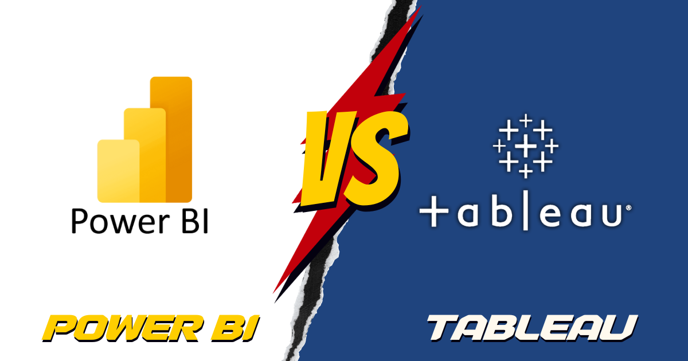

# Power BI vs. Tableau

When it comes to data visualization and business intelligence tools, two names frequently dominate the conversation: Power BI and Tableau. Both are powerful tools with dedicated user bases, and choosing between them can be a tough decision. Having used both extensively in various professional contexts, I'd like to share my experiences and insights to help you make an informed decision.

## Table of Contents

- [Introduction](#introduction)
- [Ease of Use](#ease-of-use)
- [Data Connectivity](#data-connectivity)
- [Data Visualization](#data-visualization)
- [Performance](#performance)
- [Collaboration and Sharing](#collaboration-and-sharing)
- [Licensing and Pricing](#licensing-and-pricing)
- [Community and Support](#community-and-support)
- [Conclusion](#conclusion)

## Introduction

Before we dive into the details, let's establish a few key points. Power BI and Tableau are both industry-leading data visualization tools that enable organizations to turn raw data into actionable insights. They excel in different areas and cater to various user preferences and needs. To make this comparison interactive and comprehensive, let's break it down into several categories and see how they stack up against each other.

## Ease of Use

| Aspect                  | Power BI       | Tableau         |
|-------------------------|----------------|-----------------|
| **User-Friendly**       | Yes            | Yes             |
| **Learning Curve**   	  | Low            | Moderate        |
| **Intuitiveness**       | High           | High            |

Both Power BI and Tableau are known for their user-friendly interfaces, making them accessible to users with varying levels of technical expertise. Power BI often takes the lead in this category with its seamless integration with other Microsoft products, which is beneficial for users already familiar with the Microsoft ecosystem. However, Tableau's drag-and-drop interface is also intuitive and doesn't lag far behind.

## Data Connectivity

| Aspect                  | Power BI       | Tableau         |
|-------------------------|----------------|-----------------|
| **Data Sources**        | Wide Range     | Wide Range      |
| **Ease of Integration** | Good           | Excellent       |
| **Live Connections**    | Yes            | Yes             |

Both tools offer extensive support for connecting to various data sources, including databases, cloud services, and web APIs. Tableau's strength lies in its seamless integration with almost any data source imaginable. Power BI, on the other hand, has an edge when it comes to integrating with Microsoft data solutions, like Azure and SQL Server.

## Data Visualization

| Aspect                  | Power BI       | Tableau         |
|-------------------------|----------------|-----------------|
| **Visual Options**      | Extensive      | Extensive       |
| **Customization**       | Good           | Excellent       |
| **Interactivity**       | Good           | Excellent       |

Both Power BI and Tableau offer a wide array of visualization options, allowing users to create stunning and informative dashboards. Tableau stands out with its advanced customization options, which provide more control over visual elements. If interactivity is a priority, Tableau's features for creating interactive dashboards are particularly robust.

## Performance

| Aspect                  | Power BI       | Tableau         |
|-------------------------|----------------|-----------------|
| **Speed**               | Good           | Good            |
| **Scalability**         | Good           | Excellent       |
| **Resource Efficiency** | Better          | Good            |

Tableau's in-memory processing often gets praised for its speed and responsiveness. However, Power BI has made significant improvements in recent updates, narrowing the performance gap. Tableau still holds the advantage when it comes to handling extremely large datasets and complex calculations, making it more scalable for enterprise-level solutions.

## Collaboration and Sharing

| Aspect                  | Power BI       | Tableau         |
|-------------------------|----------------|-----------------|
| **Sharing Options**     | Good           | Excellent       |
| **Collaboration Tools** | Good           | Good            |
| **Embedding**           | Yes            | Yes             |

Tableau shines in the realm of collaboration and sharing, offering robust features for sharing dashboards with both Tableau Server and Tableau Online. Power BI also provides decent collaboration tools and supports embedding reports and dashboards into web applications, which can be a significant advantage for integration with other platforms.

## Licensing and Pricing

| Aspect                  | Power BI       | Tableau         |
|-------------------------|----------------|-----------------|
| **Pricing Structure**   | Affordable     | Variable        |
| **Free Version**        | Yes            | Yes (Tableau Public) |
| **Cost of Ownership**   | Lower          | Higher          |

Power BI's pricing structure is often considered more transparent and budget-friendly. It offers a free version (Power BI Desktop) and competitive pricing for its cloud service. Tableau's pricing, while more flexible, can become expensive as your organization scales up. Be sure to evaluate your specific needs and budget constraints when making a decision.

## Community and Support

| Aspect                  | Power BI       | Tableau         |
|-------------------------|----------------|-----------------|
| **Community Size**      | Large          | Large           |
| **Official Support**    | Good           | Excellent       |
| **Third-Party Resources** | Abundant      | Abundant        |

Both Power BI and Tableau boast large and active user communities, which means you'll find plenty of resources and forums to help you troubleshoot issues and learn new techniques. Tableau's official support services have received high praise, but Power BI users can also find ample support through Microsoft's resources and partners.

## Conclusion

In the battle of Power BI vs. Tableau, there's no one-size-fits-all answer. Your choice should depend on your specific requirements, budget, and existing technology stack. Both tools are exceptional in their own right, and the decision ultimately comes down to your organization's unique needs.

I've had the privilege of working with both Power BI and Tableau extensively, and I've found each tool to excel in different scenarios. Power BI integrates seamlessly with Microsoft products, making it a natural choice for organizations heavily invested in the Microsoft ecosystem. Tableau, with its advanced customization and interactivity features, may be a better fit for those seeking to create highly customized, interactive dashboards.

Remember, the best tool is the one that aligns with your objectives and enables you to turn your data into actionable insights effectively. Take advantage of trial versions and demos to get a feel for both Power BI and Tableau before making your decision. In the end, your ability to extract meaningful insights from your data will depend more on your skills and creativity than on the tool you choose.

Choose wisely and happy data exploring!

## External Resources for Learning

Here are some external resources to help you learn more about Power BI and Tableau:

### Power BI

- [Power BI Official Documentation](https://docs.microsoft.com/en-us/power-bi/)
- [Power BI Community](https://community.powerbi.com/)
- [Power BI YouTube Channel](https://www.youtube.com/user/mspowerbi)
- [Power BI Blog](https://powerbi.microsoft.com/en-us/blog/)

### Tableau

- [Tableau Official Documentation](https://help.tableau.com/current/pro/desktop/en-us/gettingstarted_overview.htm)
- [Tableau Community](https://community.tableau.com/)
- [Tableau YouTube Channel](https://www.youtube.com/user/tableausoftware)
- [Tableau Blog](https://www.tableau.com/blog)

Explore these resources to deepen your understanding of both tools, access tutorials, and join active communities for support and discussions.
